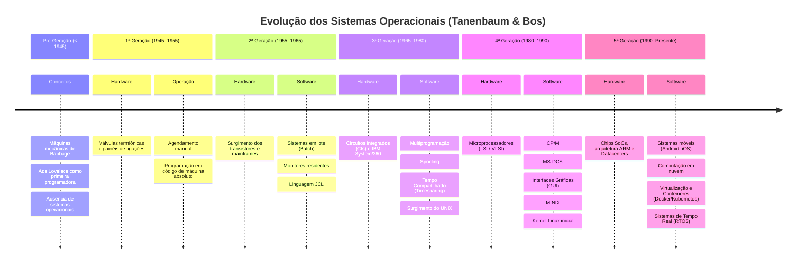

# 🖥️ Resumo da Aula: Evolução Histórica dos Sistemas Operacionais

**Instituição:** Fatec - Faculdade de Tecnologia
**Disciplina:** Sistemas Operacionais
**Professor:** Prof. Me. Deivison S. Takatu

---

## 📖 Introdução
Os **Sistemas Operacionais (SOs)** atuam como intermediários entre o usuário e o hardware, com o propósito fundamental de simplificar o uso dos computadores. Ao longo da história, eles evoluíram continuamente para dar suporte aos avanços tecnológicos e às novas formas de utilização dos sistemas computacionais.

> **📚 Bibliografia Base da Aula:** *Sistemas Operacionais Modernos* (TANENBAUM; BOS, 2015).

---

## 🕰️ A Linha do Tempo das Gerações

### 1️⃣ Primeira Geração (1945–1955): Válvulas e Painéis
* **Tecnologia Principal:** Válvulas eletrônicas.
* **Características Físicas:** Eram máquinas gigantescas, caras, consumiam muita energia e apresentavam falhas constantes.
* **Programação:** Feita diretamente em **código de máquina**, sendo específica para cada hardware.
* **Operação:** Programar, na maioria dos casos, exigia a alteração de conexões físicas ou a manipulação direta de painéis da máquina.

### 2️⃣ Segunda Geração (1955–1965): Transistores e Sistemas em Lote (Batch)
* **Tecnologia Principal:** Transistores (que substituíram as antigas válvulas).
* **Avanços:** Os transistores aumentaram consideravelmente a confiabilidade. As máquinas se tornaram menores, mais rápidas e viáveis para uso comercial.
* **Processamento em Lote (Batch):** O sistema executava vários programas em sequência de forma automática, sem interação direta do usuário. Os trabalhos eram preparados antecipadamente.
* **Entrada de Dados:** Tanto os programas quanto os dados eram inseridos por meio de **cartões perfurados**.

### 3️⃣ Terceira Geração (1965–1980): Circuitos Integrados e Multiprogramação
* **Tecnologia Principal:** Circuitos Integrados.
* **Avanços:** Possibilitaram a criação de computadores ainda mais compactos e potentes. Consequentemente, os SOs tornaram-se mais complexos e eficientes.
* **Multiprogramação:** Recurso que permitia manter vários programas carregados na memória de forma simultânea. Quando um programa pausava para aguardar uma operação de E/S (Entrada/Saída), a CPU era automaticamente alocada para outro programa.
* **Compartilhamento de Tempo (Timesharing):** Permitiu que múltiplos usuários utilizassem o sistema simultaneamente através de terminais conectados a um computador central.
* **Spooling:** Os dados de entrada e saída passaram a ser armazenados em disco, reduzindo a dependência de fitas magnéticas e aumentando drasticamente a eficiência global.

### 4️⃣ Quarta Geração (1980–presente): Computadores Pessoais (PCs) e GUI
* **Tecnologia Principal:** Microprocessadores e PCs.
* **Avanços:** Os computadores deixaram de ser exclusivos de grandes corporações e tornaram-se acessíveis a usuários individuais. O foco do desenvolvimento mudou para a **facilidade de uso**.
* **Interface Gráfica do Usuário (GUI):** Ocorreu a substituição dos difíceis comandos textuais por elementos visuais intuitivos.
* **O Impacto do UNIX:** Surgiu como uma alternativa simplificada ao sistema MULTICS. Sua arquitetura influenciou de forma decisiva a tecnologia moderna, sendo a base fundamental para sistemas como Linux, macOS, iOS e Android.

### 5️⃣ Quinta Geração (1990–presente): A Era dos Smartphones
* **Contexto:** Embora a ideia de mesclar telefonia e computação seja da década de 1970, só se materializou de fato nos anos 1990.
* **Marcos Importantes:**
  * **Nokia N9000 (meados de 1990):** Considerado o primeiro "smartphone" real, combinando a função de telefone celular com a de um PDA (Assistente Digital Pessoal).
  * **Ericsson GS88 (1997):** O modelo "Penelope" foi o responsável por cunhar e popularizar o termo *smartphone*.

### 🔮 Sexta Geração: Entendendo o Futuro
* A história da tecnologia é cíclica e cheia de padrões. Estudar o passado nos fornece as pistas necessárias para imaginar como será a sexta geração de Sistemas Operacionais.

---

## 📊 Tabela Resumo das Tecnologias

| Geração | Período | Inovação de Hardware | Principal Evolução do SO |
| :--- | :--- | :--- | :--- |
| **1ª** | 1945–1955 | Válvulas | Operação por código de máquina/painéis |
| **2ª** | 1955–1965 | Transistores | Sistemas em Lote (Batch) e cartões perfurados |
| **3ª** | 1965–1980 | Circuitos Integrados | Multiprogramação, Timesharing e Spooling |
| **4ª** | 1980–hoje | Microprocessadores (PCs) | Interfaces Gráficas (GUI) e popularização do UNIX |
| **5ª** | 1990–hoje | Dispositivos Móveis | SOs para Smartphones (integração de PDA e telefonia)|

---

## ⚙️ Diretrizes da Atividade Prática
Para fins de documentação, os passos da atividade exigida na aula foram:
1. **Repositório:** Criar um arquivo `.md` no repositório da disciplina contendo um resumo detalhado (mais de 500 linhas) do capítulo "História dos sistemas operacionais" do livro do Tanenbaum.
2. **Linha do Tempo:** Utilizar o Miro para dividir a história em gerações, inserindo exemplos e detalhamentos, e exportar o material como fonte de estudo para o GitHub.

---

## 📌 Atividade Aula 2 Resumo do Capítulo 1.2: 

---

## Capítulo 1.2: "História dos Sistemas Operacionais"
📑 *Obra de Referência: **Sistemas Operacionais Modernos** (4ª Edição) — Andrew S. Tanenbaum & Herbert Bos*

---

## 💾 INTRODUÇÃO GERAL E ANTECEDENTES HISTÓRICOS

A história dos sistemas operacionais é indissociável da evolução do hardware dos computadores. Historicamente, as mudanças arquiteturais na infraestrutura física forçaram e direcionaram o surgimento de novas camadas de abstração de software. Para compreender os sistemas operacionais modernos, é necessário examinar como a indústria migrou de processos puramente manuais e mecânicos para arquiteturas multiprogramadas, distribuídas e móveis.

### A Função Fundamental do Sistema Operacional
* **Abstração de Hardware:**
  * O SO transforma o hardware bruto, complexo e heterogêneo em uma máquina virtual limpa e homogênea.
  * O programador de aplicações não precisa lidar com sinais elétricos, tempos de busca em disco ou interrupções de baixo nível.
* **Gerenciamento de Recursos:**
  * Atua como um alocador de recursos (CPU, memória, dispositivos de entrada/saída, espaço em disco).
  * Resolve conflitos de requisições concorrentes entre múltiplos programas de maneira justa, segura e eficiente.

### A Pré-História dos Computadores: A Era Mecânica
* **Charles Babbage (1792–1871):**
  * Projetou a **Máquina Diferencial** para cálculo de tabelas navegais e matemáticas.
  * Projetou a **Máquina Analítica**, considerada o primeiro projeto teórico de um computador digital universal.
  * A estrutura contava com "Engenho" (CPU) e "Armazém" (Memória), operada por engrenagens, eixos e rodas dadas.
  * A máquina era puramente mecânica; devido às limitações tecnológicas da época na usinagem de precisão, nunca pôde ser completamente construída e operacionalizada em sua vida.
  * A Máquina Analítica não possuía sistema operacional.
* **Ada Lovelace (1815–1852):**
  * Contratada por Babbage para traduzir e anotar os escritos de Luigi Menabrea sobre a Máquina Analítica.
  * Escreveu o primeiro algoritmo destinado a ser processado por uma máquina (o cálculo dos Números de Bernoulli).
  * É reconhecida historicamente como a **primeira programadora do mundo**.
  * Antecipou conceitos de loops, ramificações condicionais e subrotinas.
  * A linguagem de programação *Ada* foi nomeada em sua homenagem.

---

## 🔩 1.2.1 A PRIMEIRA GERAÇÃO (1945–1955): VÁLVULAS E PAINÉIS DE LIGAÇÕES

A Primeira Geração de computadores digitais foi impulsionada pelas necessidades tecnológicas e militares decorrentes da Segunda Guerra Mundial, marcando a transição dos componentes mecânicos para os eletrônicos.

### 1. Principais Marcos Tecnológicos e Máquinas Pioneiras
* **Computador Atanasoff-Berry (ABC):**
  * Construído por John Atanasoff e Clifford Berry na Universidade do Estado de Iowa.
  * Utilizava cerca de 300 válvulas termiônicas e capacitores num tambor rotativo para memória.
  * Considerado o primeiro computador digital eletrônico funcional para equações lineares.
* **Z3 (1941):**
  * Construído por Konrad Zuse em Berlim, baseado em relés eletromagnéticos.
  * Primeira máquina de calcular programável e automática do mundo.
* **Colossus (1943):**
  * Projetado por uma equipe liderada por Tommy Flowers e Alan Turing em Bletchley Park, Inglaterra.
  * Focado na criptanálise de mensagens codificadas pela máquina alemã Lorenz SZ40/42.
* **Mark I (1944):**
  * Projetado por Howard Aiken em Harvard em parceria com a IBM.
  * Dispositivo eletromecânico massivo controlado por fita de papel perfurada.
* **ENIAC (Electronic Numerical Integrator and Computer - 1946):**
  * Projetado por William Mauchly e J. Presper Eckert na Universidade da Pensilvânia.
  * Continha cerca de 18.000 válvulas, pesava 30 toneladas e consumia 150 kW de potência.
  * Usado para cálculos de trajetórias de artilharia e simulações da bomba de hidrogênio.

### 2. Modus Operandi da Primeira Geração
* **Ausência Absoluta de Sistema Operacional:**
  * Não existia qualquer camada de software residente ou intermédio entre o programador e a máquina.
* **Acúmulo de Papéis Unificados:**
  * O mesmo grupo de indivíduos (engenheiros e matemáticos) era responsável por projetar, construir, programar, operar, diagnosticar falhas e manter a máquina.
* **Programação em Código de Máquina Absoluto:**
  * Não existiam linguagens de alto nível (Fortran, C) e nem linguagens de montagem (*Assembly*).
  * A programação consistia na conexão física de milhares de cabos a **painéis de ligações** (*plugboards*) para controlar as rotinas da máquina.
* **Alocação de Tempo e Processo de Execução:**
  * O programador assinava um bloco de tempo (ex.: 2 horas) em uma folha de agendamento fixada na parede.
  * Entrava fisicamente na sala de máquinas climatizada, inseria seu painel de ligações personalizado e executava o programa.
  * A confiabilidade era precária; a taxa de falha MFT (Mean Time Between Failures) era baixíssima, sendo comum válvulas queimarem a cada poucos minutos de operação.
* **Natureza dos Problemas Tratados:**
  * Foco quase exclusivo em cálculos numéricos e matemáticos puros (ex.: tabelas de senos, cossenos, logaritmos, matrizes e trajetórias balísticas).
* **Transição ao Final da Primeira Geração (Anos 1950):**
  * Substituição progressiva dos painéis de ligações por leitores de **cartões perfurados**, eliminando a necessidade de reconfigurar fios e cabos manuais.

---

## ⚙ 1.2.2 A SEGUNDA GERAÇÃO (1955–1965): TRANSISTORES E SISTEMAS EM LOTE (*BATCH*)

A invenção do transistor nos laboratórios Bell em 1947 (por John Bardeen, Walter Brattain e William Shockley) e sua aplicação comercial em meados dos anos 1950 alteraram radicalmente a confiabilidade da computação.

### 1. Mutações Estruturais e Operacionais
* **Surgimento dos Mainframes:**
  * Computadores de grande porte alocados em salas especiais climatizadas e protegidas.
* **Especialização e Divisão do Trabalho:**
  * Pela primeira vez na história da computação, ocorreu uma separação rigorosa de funções profissionais:
    * Projetistas de hardware (Engenheiros eletrônicos)
    * Fabricantes de computadores
    * Operadores de sala de máquinas (profissionais dedicados a manusear o computador)
    * Programadores (escreviam algoritmos)
    * Equipe de manutenção e infraestrutura
* **Custo Elevado de Aquisição e Operação:**
  * As máquinas custavam milhões de dólares e eram acessíveis apenas a governos, corporações multinacionais e grandes universidades.

### 2. O Gargalo Operacional Manual
No modelo inicial de execução da segunda geração:
1. O programador escrevia o código em folhas de codificação (FORTRAN ou *Assembly*).
2. O código era entregue a uma operadora de máquina de perfurar cartões.
3. O deck de cartões perfurados era levado à sala de entrada de tarefas (*job input room*).
4. O operador da sala de máquinas carregava manualmente o compilador de uma fita magnética.
5. O operador inseria os cartões perfurados no leitor e iniciava a execução.
6. O programa gerava a saída em uma impressora de linha.
7. A saída impressa era levada à sala de entrega para o programador recolher horas ou dias depois.
* **O Incômodo Problema da Ociosidade:**
  * A CPU (o recurso mais caro da máquina) ficava ociosa por longos períodos enquanto os operadores trocavam fitas, limpavam impressoras e organizavam pilhas de cartões.

### 3. A Solução: Sistemas em Lote (*Batch Systems*)
Para otimizar o tempo de processamento da CPU e eliminar a intervenção humana entre as tarefas, foram criados os **sistemas em lote**.

#### Fluxo de Trabalho Integrado de um Sistema Batch:
1. **Coleta de Tarefas:** Dezenas de programas de programadores diferentes eram reunidos em um lote (*batch*).
2. **Gravação em Fita de Entrada:**
   * Utilizava-se um computador secundário, menor e barateado (ex.: **IBM 1401**), altamente eficiente na leitura de cartões e manipulação de fitas.
   * O IBM 1401 lia os cartões perfurados do lote e gravava todos os programas sequencialmente em uma fita magnética de entrada.
3. **Processamento no Computador Principal:**
   * A fita de entrada era transferida fisicamente para o computador principal de alto desempenho (ex.: **IBM 7094**).
4. **O Programa Monitor (O Primeiro SO Rudimentar):**
   * O IBM 7094 rodava um software permanente chamado **Monitor Resident** (ex.: FMS - Fortran Monitor System ou IBSYS).
   * O monitor lia a primeira tarefa da fita, carregava o compilador apropriado, executava a tarefa e gravava a resposta em uma fita magnética de saída.
   * Ao terminar, o monitor passava automaticamente para a próxima tarefa contida na fita, sem pausar a CPU.
5. **Impressão Off-line:**
   * A fita magnética de saída era levada de volta ao IBM 1401, que imprimia todos os resultados fora do computador principal.

    +-------------------+        +--------------------+        +---------------------+
    |   Programadores   |        |      IBM 1401      |        |      IBM 7094       |
    | (Cartões Perf.)   | ====>  | (Leitura de Cartão | ====>  | (Processamento de   |
    |                   |        |   para Fita)       |        |   Alto Desempenho)  |
    +-------------------+        +--------------------+        +---------------------+
                                                                          |
                                                                          | Fita de
                                                                          | Saída
                                                                          v
    +-------------------+        +--------------------+                   |
    | Relatórios em     | <====  |      IBM 1401      | <-----------------+
    | Papel Impresso    |        | (Impressão de Fita)|
    +-------------------+        +--------------------+

### 4. Linguagem de Controle de Tarefas (JCL - Job Control Language)
Para instruir o monitor residente sobre o que fazer com cada tarefa dentro do lote, os cartões perfurados continham comandos de controle específicos.

* Exemplo de estrutura de cartões de uma tarefa JCL típica:
  * `$JOB`: Define limites de tempo de CPU, conta de faturamento e nome do usuário.
  * `$FORTRAN`: Instrução para o monitor carregar o compilador FORTRAN da fita.
  * *[Código-Fonte em FORTRAN]*
  * `$LOAD`: Instrução para carregar o código objeto gerado pelo compilador.
  * `$RUN`: Comando de execução do programa.
  * *[Dados do Programa]*
  * `$END`: Marcação do fim do job atual dentro da fita de lote.

---

## 🔧 1.2.3 A TERCEIRA GERAÇÃO (1965–1980): CIRCUITOS INTEGRADOS E MULTIPROGRAMAÇÃO

O surgimento do Circuito Integrado (CI) de silício permitiu colocar dezenas de transistores em um único chip (tecnologia SSI e MSI). Isso reduziu o tamanho e o custo do hardware, ao mesmo tempo que aumentou drasticamente a velocidade de processamento.

### 1. O Dilema das Linhas Incompatíveis de Computadores
Até meados da década de 1960, a indústria de computadores produzia duas linhas de produtos totalmente isoladas e incompatíveis:
* **Sistemas Científicos (ex.: IBM 7094):**
  * Projetados para cálculos intensivos de ponto flutuante.
  * Utilizados por engenheiros, físicos e universidades.
* **Sistemas Comerciais (ex.: IBM 1401):**
  * Projetados para manipulação de caracteres, ordenação de arquivos e impressão de relatórios.
  * Utilizados por bancos, seguradoras e departamentos de contabilidade.

A manutenção de duas arquiteturas distintas exigia o desenvolvimento de softwares de sistema, compiladores e rotinas de manutenção duplicadas, gerando custos colossais para os fabricantes e inviabilizando a migração de softwares pelos clientes.

### 2. A Solução Unificada: IBM System/360 e o OS/360
* Em 1964, a IBM anunciou a família **System/360**, uma linha unificada de computadores projetada para atender simultaneamente aos mercados científico e comercial.
* **A Grande Inovação de Arquitetura:**
  * Todas as máquinas da linha compartilhavam a mesma Arquitetura de Conjunto de Instruções (ISA - Instruction Set Architecture).
  * Um programa escrito para um modelo pequeno e barato rodava perfeitamente em um modelo gigante de mainframe sem necessidade de recompilação.
* **O Sistema Operacional OS/360:**
  * Foi o primeiro grande sistema operacional genérico a ter que rodar em máquinas de portes imensamente variados e com múltiplos periféricos.
  * Continha milhões de linhas de código Assembly escrito por centenas de programadores.
  * Sofreu graves atrasos e estouros de orçamento (imortalizados no livro *The Mythical Man-Month* de Fred Brooks), mas introduziu conceitos que definiram a engenharia de software de sistemas.

### 3. As Grandes Inovações Tecnológicas da Terceira Geração

#### A. Multiprogramação
* **O Problema do Processamento em Lote Continuo:**
  * Quando um programa solicitava uma operação de leitura/escrita em fita ou disco, a CPU ficava totalmente ociosa aguardando a conclusão mecânica da E/S (que era ordens de grandeza mais lenta que a velocidade da CPU).
* **A Solução da Multiprogramação:**
  * A memória principal é dividida em partições lógicas independentes.
  * Múltiplos programas (jobs) são mantidos na memória ao mesmo tempo.
  * Enquanto o Trabalho A aguarda a conclusão de uma operação de Entrada/Saída, o sistema operacional intervém e concede a CPU para executar o Trabalho B.
  * Quando o Trabalho B bloqueia por E/S, a CPU é entregue ao Trabalho C, maximizando a eficiência e o uso da taxa de ocupação do processador.
* **Requisitos de Hardware Adquiridos:**
  * Exigiu a criação de mecanismos de proteção de memória em hardware (registradores base e limite) para impedir que um programa corrompesse a partição de memória de outro.

    Memória Principal com Multiprogramação:
    +------------------------------------+
    | Sistema Operacional (OS/360)       |
    +------------------------------------+
    | Job 1 (Aguardando Leitura de Disco)|  ====> CPU executa Job 2!
    +------------------------------------+
    | Job 2 (Em Execução de Cálculo)     |
    +------------------------------------+
    | Job 3 (Aguardando Impressão)       |
    +------------------------------------+
    | Espaço Livre / Partição Disponível |
    +------------------------------------+

#### B. Spooling (Simultaneous Peripheral Operations On Line)
* Eliminou a necessidade de computadores secundários (como o IBM 1401) para transporte físico de fitas magnéticas.
* Os dados lidos do leitor de cartões eram copiados diretamente para um disco magnético rígido conforme chegavam.
* O sistema operacional organizava a fila de execução a partir do disco. Quando uma tarefa terminava, o SO carregava o próximo job do disco diretamente para a memória.
* Da mesma forma, as saídas eram gravadas no disco e enviadas para a impressora conforme esta ficava disponível.

#### C. Tempo Compartilhado (Timesharing)
* Embora a multiprogramação aumentasse a eficiência da máquina, os programadores ainda enfrentavam longos tempos de resposta (horas para descobrir um erro de sintaxe em um cartão perfurado).
* O **Timesharing** foi uma evolução da multiprogramação focada no usuário interativo.
* Cada usuário utilizava um terminal de vídeo/teclado conectado ao mainframe.
* O SO fatiou o tempo da CPU em pequenos intervalos de milissegundos (*time slices* ou *quanta*).
* A CPU alternava tão rapidamente entre os terminais de dezenas de usuários conectados que cada um tinha a ilusão interativa de possuir um computador exclusivo.

#### D. Sistemas Operacionais Icônicos do Período
* **CTSS (Compatible Time-Sharing System):** Desenvolvido no MIT em 1961, demonstrou a viabilidade do tempo compartilhado.
* **MULTICS (Multiplexed Information and Computing Service):**
  * Projeto grandioso iniciado pelo MIT, Bell Labs e General Electric.
  * Pretendia criar uma utilidade pública de computação (semelhante à distribuição de energia elétrica).
  * Introduziu a organização de memória segmentada e paginada, conceitos avançados de segurança e sistemas de arquivos hierárquicos.
  * Embora complexo demais para o hardware da época, serviu de incubadora teórica para os sistemas futuros.
* **O Surgimento do UNIX:**
  * Após a saída da Bell Labs do projeto MULTICS em 1969, Ken Thompson, Dennis Ritchie, Brian Kernighan e Douglas McIlroy desenvolveram uma versão simplificada do sistema em um computador PDP-7 ocioso.
  * Batizado de **UNIX** (uma piada trocadilho com o MULTICS), o sistema foi reescrito em **Linguagem C** por Dennis Ritchie em 1973, tornando-o o primeiro sistema operacional portátil de alto nível.
  * O UNIX espalhou-se por universidades e centros de pesquisa, dando origem às ramificações BSD (Universidade de Berkeley) e System V (AT&T).

---

## 🖥 1.2.4 A QUARTA GERAÇÃO (1980–PRESENTE): COMPUTADORES PESSOAIS

O desenvolvimento dos circuitos integrados LSI (*Large Scale Integration*) e VLSI (*Very Large Scale Integration*) permitiu condensar milhões de transistores num único chip de silício. Nascia o microprocessador, viabilizando o computador pessoal.

### 1. Nascimento do Microprocessador e dos Microcomputadores
* O lançamento do processador Intel 8080 em 1974 permitiu a criação dos primeiros microcomputadores para entusiastas, como o Altair 8800.
* **CP/M (Control Program for Microcomputers):**
  * Criado por Gary Kildall da Digital Research para processadores Intel 8080 e Zilog Z80.
  * Foi o primeiro sistema operacional padrão de mercado para microcomputadores de 8 bits.
  * Separava claramente as rotinas de I/O específicas de hardware (BIOS) do sistema operacional básico (BDOS) e do interpretador de comandos (CCP).

### 2. O IBM PC e a Ascensão do MS-DOS
* Em 1981, a IBM decidiu entrar no mercado de computadores pessoais com o **IBM PC**, utilizando o processador Intel 8088 de 16 bits.
* A IBM procurou a Microsoft para obter um sistema operacional. Bill Gates e Paul Allen adquiriram o **QDOS** (*Quick and Dirty Operating System*) escrito por Tim Paterson da Seattle Computer Products, adaptaram-no e o licenciaram para a IBM sob o nome **PC-DOS** (e comercializado independentemente pela Microsoft como **MS-DOS**).
* **Características do MS-DOS:**
  * Operava estritamente por Interface de Linha de Comando (CLI).
  * Era um sistema monotarefa e monousuário.
  * Não oferecia proteção de memória: os programas tinham acesso direto às portas de I/O e ao espaço de memória do próprio sistema operacional.
  * A capacidade de memória RAM do sistema era limitada pela famosa barreira de 640 KB.

### 3. A Era da Interface Gráfica do Usuário (GUI)
* **As Origens no Xerox PARC:**
  * O centro de pesquisas da Xerox em Palo Alto (PARC) criou o computador **Xerox Alto** na década de 1970.
  * O Alto introduziu a Interface Gráfica baseada no paradigma WIMP (*Windows, Icons, Menus, Pointer*), operada por mouse e tela bitmaps.
* **Apple Macintosh (1984):**
  * Steve Jobs visitou o Xerox PARC e assimilou os conceitos gráficos, aplicando-os no projeto Apple Lisa e, posteriormente, no lendário **Apple Macintosh** em 1984.
  * O Macintosh foi o primeiro microcomputador de massa a oferecer uma GUI amigável, eliminando a necessidade de memorizar comandos de texto complexos.
* **Evolução da Linha Microsoft Windows:**
  * **Windows 1.0, 2.0 e 3.x:** Lançados na década de 1980 e início de 1990, não eram sistemas operacionais completos, mas sim extensões gráficas que rodavam sobre o MS-DOS.
  * **Windows 95:** Sistema operacional real de 32 bits, com suporte nativo a multitarefa preempitiva, suporte ao recurso *Plug and Play* e a famosa interface com Barra de Tarefas e Menu Iniciar.
  * **Arquitetura Windows NT:** Projetada por Dave Cutler, foi criada do zero como um SO corporativo de 32 bits, multiprocessado, seguro e estável. Deu origem ao Windows 2000, XP, Vista, 7, 8, 10 e 11.

### 4. O Sistema UNIX, MINIX e o Fenômeno Linux
* **Sistemas UNIX Comerciais:** Na década de 1980, variantes do UNIX dominavam estações de trabalho de alto desempenho (SunOS/Solaris, HP-UX, IBM AIX).
* **MINIX:**
  * Desenvolvido pelo professor **Andrew S. Tanenbaum** como um sistema educacional para acompanhar seu livro de sistemas operacionais.
  * Projetado com uma arquitetura elegante de **Microkernel**, onde apenas o gerenciamento de processos e memória rodam no modo núcleo, e os drivers de dispositivos rodam no modo usuário.
  * O código-fonte era pequeno e aberto para estudantes do mundo todo analisar.
* **Linux:**
  * Em 1991, o estudante finlandês **Linus Torvalds**, frustrado com as limitações de licenciamento do MINIX na época, começou a desenvolver seu próprio núcleo (kernel) de 32 bits para processadores Intel 386.
  * Linus lançou o kernel **Linux** como software livre.
  * Unindo o kernel Linux com os utilitários de sistema e compiladores do **Projeto GNU** (fundado por Richard Stallman em 1983), nasceu o sistema operacional completo **GNU/Linux**.
  * O Linux adotou uma arquitetura de kernel monolítico modular e tornou-se a espinha dorsal de servidores Web, supercomputadores, infraestruturas de nuvem e bancos de dados globais.

---

## 💻 1.2.5 A QUINTA GERAÇÃO (1990–PRESENTE): DISPOSITIVOS MÓVEIS, NUVEM E IOT

A Quinta Geração expandiu os limites dos computadores de mesa tradicionais para a computação ubíqua, invisível, móvel e highly distribuída.

### 1. Sistemas Operacionais Móveis
Com a rápida evolução dos microprocessadores de arquitetura ARM (focada em baixo consumo de energia), os telefones celulares evoluíram para smartphones de altíssimo desempenho.

* **iOS (Apple):**
  * Baseado no núcleo Darwin (UNIX / Mach) do macOS.
  * Otimizado para consumo energético rigoroso, resposta de toque em tempo real e aceleração de hardware gráfico.
  * Apresenta forte isolamento de processos (*sandboxing*) para impedir vazamento de dados entre aplicativos.
* **Android (Google):**
  * Construído sobre uma versão modificada do Kernel Linux.
  * Utiliza uma máquina virtual/runtime (Dalvik e, posteriormente, ART - Android Runtime) para executar aplicativos desenvolvidos em Java e Kotlin.
  * Utiliza um sistema estrito de gerenciamento de permissões granulares e isolamento de usuários do Linux para cada aplicativo.

### 2. Computação em Nuvem e Datacenters Distribuídos
* A capacidade de processamento migrou dos computadores locais para agrupamentos massivos de servidores localizados em *datacenters* globais.
* **Virtualização e Hypervisors:**
  * Permitem rodar múltiplos sistemas operacionais virtuais (Guest OS) sobre uma única máquina física (Host) por meio de camadas como Xen, KVM e VMware.
* **Contêineres e Orquestração:**
  * Evolução do isolamento de processos no Linux (usando *namespaces* e *cgroups*).
  * Ferramentas como **Docker** e **Kubernetes** gerenciam milhares de instâncias de aplicações leves sem a necessidade de simular hardware completo, funcionando como um "SO distribuído" para datacenters.

### 3. Internet das Coisas (IoT) e Sistemas de Tempo Real (RTOS)
* A inclusão de microcontroladores em eletrodomésticos, veículos autônomos, robôs industriais e dispositivos médicos exigiu uma nova classe de sistemas operacionais.
* **RTOS (Real-Time Operating Systems):**
  * Diferente de um SO de propósito geral (como Windows ou Linux), um RTOS (ex.: FreeRTOS, VxWorks) é focado em **determinismo temporal**.
  * Garantem que uma tarefa prioritária seja processada dentro de um prazo limite (*deadline*) estrito. Uma falha de tempo em um RTOS de freios ABS, por exemplo, é considerada uma falha total do sistema.

---

## 📑 1.2.6 CONCEITOS E ARQUITETURAS FUNDAMENTAIS DO CAPÍTULO

Para consolidar os ensinamentos da evolução histórica apresentada por Tanenbaum & Bos, os sistemas operacionais modernos organizam-se em torno de pilares de arquitetura de software e hardware:

    +-------------------------------------------------------------------+
    |                    Aplicativos e Programas de Usuário              |
    +-------------------------------------------------------------------+
                                      |
                                      | Chamadas de Sistema (Syscalls)
                                      v
    +-------------------------------------------------------------------+
    |               SISTEMA OPERACIONAL (Modo Núcleo / Kernel)           |
    |  +------------------+  +-------------------+  +-----------------+ |
    |  | Gerenciamento de |  | Gerenciamento de  |  | Sistema de      | |
    |  | Processos/Threads|  | Memória Virtual   |  | Arquivos e E/S  | |
    |  +------------------+  +-------------------+  +-----------------+ |
    +-------------------------------------------------------------------+
                                      |
                                      | Instruções de Hardware Protegidas
                                      v
    +-------------------------------------------------------------------+
    |             HARDWARE BRUTO (CPU, Memória RAM, Discos, I/O)         |
    +-------------------------------------------------------------------+

### 1. Modos de Operação da CPU e Chamadas de Sistema (*Syscalls*)
Para evitar que programas corrompam o sistema ou acessem dados de outros usuários, os processadores possuem modos de execução:
* **Modo Usuário (*User Mode* / Ring 3):**
  * Os programas de aplicação executam com um conjunto reduzido de instruções.
  * Acesso direto à memória física ou dispositivos de E/S é proibido pelo hardware.
* **Modo Núcleo (*Kernel Mode* / Ring 0):**
  * O kernel do sistema operacional executa com privilégios totais de hardware.
* **Chamada de Sistema (*Syscall*):**
  * Quando um programa precisa ler um arquivo ou alocar memória, ele executa uma instrução especial de interrupção por software (ex.: `INT 0x80`, `SYSCALL` ou `TRAP`).
  * A CPU alterna imediatamente do Modo Usuário para o Modo Núcleo e transfere o controle para o endereço do tratador do SO.

### 2. Estruturas Internas do Kernel
* **Kernel Monolítico:**
  * Todos os serviços do SO (escalonador, sistema de arquivos, drivers de dispositivos, pilha de rede) rodam dentro do mesmo espaço de endereçamento no modo núcleo.
  * *Vantagem:* Altíssimo desempenho e velocidade de chamada interna.
  * *Desvantagem:* Se um driver de impressora tiver um erro de ponteiro, o kernel inteiro trava (Tela Azul / Kernel Panic).
  * *Exemplos:* Linux, Windows, macOS (núcleo híbrido XNU), FreeBSD.
* **Microkernel:**
  * Mantém apenas as funções absolutamente essenciais no modo núcleo (comunicação IPC, gerenciamento básico de memória e escalonamento).
  * Todos os outros serviços (drivers de dispositivo, sistemas de arquivos) rodam no modo usuário como servidores independentes.
  * *Vantagem:* Altíssima tolerância a falhas e segurança. Se o driver de disco quebrar, ele é reiniciado sem derrubar o SO.
  * *Desvantagem:* Maior custo de chaveamento de contexto e troca de mensagens.
  * *Exemplos:* MINIX 3, QNX, L4.

---

## 💾 1.2.7 GLOSSÁRIO TÉCNICO E CONCEITUAL COMPLETO DO CAPÍTULO 1.2

A tabela abaixo compila os termos fundamentais citados ao longo do capítulo sobre a história e fundamentos dos sistemas operacionais:

| Termo Técnico | Categoria | Definição e Relevância Histórica |
| :--- | :--- | :--- |
| **Válvula Termiônica** | Hardware (G1) | Componente eletrônico selado a vácuo usado para amplificar ou comutar sinais. Base da 1ª Geração de computadores. |
| **Transistor** | Hardware (G2) | Dispositivo semicondutor que substituiu as válvulas, aumentando a confiabilidade e reduzindo drasticamente o consumo elétrico. |
| **Circuito Integrado (CI)** | Hardware (G3) | Pastilha de silício contendo múltiplos transistores miniaturizados interconectados, marcando a 3ª Geração. |
| **VLSI** | Hardware (G4) | *Very Large Scale Integration*. Tecnologia que permitiu colocar milhões de transistores em um único chip, gerando o microprocessador. |
| **Painel de Ligações** | Operação (G1) | Placa física (*plugboard*) onde cabos eram inseridos manualmente para programar as rotinas do computador. |
| **Cartão Perfurado** | Mídia (G1/G2) | Cartão de papel rígido contendo furos em posições pré-determinadas representando dados ou instruções de código. |
| **Sistema Batch** | Software (G2) | Sistema de processamento em lote que agrupava programas em fita magnética para execução contínua sem pausa humana. |
| **Monitor Residente** | Software (G2) | Programa precursor do SO que permanecia na memória para carregar automaticamente o próximo job da fita de lote. |
| **JCL** | Software (G2) | *Job Control Language*. Conjunto de comandos de controle inseridos entre os cartões para instruir o monitor residente. |
| **Multiprogramação** | Conceito (G3) | Técnica de manter múltiplos programas na memória RAM simultaneamente, alternando a CPU quando um programa bloqueia por E/S. |
| **Spooling** | Conceito (G3) | *Simultaneous Peripheral Operations On Line*. Leitura/escrita simultânea de dados no disco magnético para evitar gargalos de E/S. |
| **Timesharing** | Conceito (G3) | Divisão do tempo da CPU em pequenas fatias para atender a múltiplos usuários interativos em terminais simultaneamente. |
| **MULTICS** | SO (G3) | Projeto pioneiro de SO de tempo compartilhado que influenciou a criação do UNIX e conceitos de sistemas de arquivos. |
| **UNIX** | SO (G3/G4) | Sistema operacional portátil, multitarefa e multiusuário criado na Bell Labs por Ken Thompson e Dennis Ritchie em C. |
| **CP/M** | SO (G4) | *Control Program for Microcomputers*. O primeiro sistema operacional padrão de mercado para microcomputadores de 8 bits. |
| **MS-DOS** | SO (G4) | Sistema de linha de comando de 16 bits para o IBM PC, base para o crescimento comercial da Microsoft nos anos 1980. |
| **GUI** | Interface (G4) | *Graphical User Interface*. Interface visual baseada em janelas, ícones, menus e dispositivo ponteiro (mouse). |
| **MINIX** | SO (G4) | Sistema operacional educacional com arquitetura Microkernel criado pelo professor Andrew S. Tanenbaum. |
| **Linux** | Kernel (G4/G5) | Kernel de código aberto escrito por Linus Torvalds em 1991, base para distribuições GNU/Linux e Android. |
| **Modo Núcleo** | Segurança | *Kernel Mode / Ring 0*. Modo de execução da CPU com privilégios totais e acesso irrestrito ao hardware. |
| **Modo Usuário** | Segurança | *User Mode / Ring 3*. Modo de execução restrito onde rodam as aplicações do usuário para evitar danos ao sistema. |
| **Syscall** | Mecanismo | *System Call*. Mecanismo formal de interrupção para um programa em Modo Usuário solicitar serviços ao Kernel. |
| **Kernel Monolítico** | Arquitetura | Estrutura onde todas as funções do SO rodam consolidadas no mesmo espaço de memória do modo núcleo. |
| **Microkernel** | Arquitetura | Estrutura minimalista onde apenas funções críticas rodam no núcleo, transferindo drivers e arquivos para o modo usuário. |
| **RTOS** | SO (G5) | *Real-Time Operating System*. Sistema focado em garantias estritas de tempo de resposta determinístico para eventos. |
| **Sandboxing** | Segurança | Técnica de isolamento que restringe os recursos e dados que um aplicativo pode acessar dentro do sistema. |
| **Hypervisor** | Virtualização | Camada de software ou hardware que gerencia a execução de múltiplas máquinas virtuais num único host físico. |
| **Contêiner** | Virtualização | Mecanismo de virtualização em nível de SO que compartilha o mesmo kernel mantendo ambientes de usuário isolados. |

---

## 🖥 1.2.8 QUADRO SÍNTESE COMPARATIVO DAS GERAÇÕES DOS SISTEMAS OPERACIONAIS

A tabela a seguir consolida as transformações tecnológicas que caracterizaram as cinco gerações descritas na obra de Tanenbaum & Bos:

    +----------+------------------+---------------------+---------------------+-----------------------+
    | Geração  | Tecnologia Base  | Elemento de Software| Modus Operandi      | Tipo de Aplicação     |
    +----------+------------------+---------------------+---------------------+-----------------------+
    | G0       | Engrenagens e    | Nenhum (hardware    | Ajustes mecânicos   | Tabelas matemáticas   |
    | (< 1945) | eixos mecânicos  | puro)               | manuais             | e navegação           |
    +----------+------------------+---------------------+---------------------+-----------------------+
    | G1       | Válvulas e       | Painéis de conexões | Agendamento manual, | Cálculos balísticos,  |
    | (1945-55)| Cartões perfurados e linguagem máquina | substituição cabos  | matrizes e senos      |
    +----------+------------------+---------------------+---------------------+-----------------------+
    | G2       | Transistores e   | Monitores em Lote   | Sistemas Batch,     | Processamento de      |
    | (1955-65)| Fitas Magnéticas | (FMS, IBSYS), JCL   | fitas de entrada/saída folha de pagamento     |
    +----------+------------------+---------------------+---------------------+-----------------------+
    | G3       | Circuitos        | Multiprogramação,   | Tempo Compartilhado | Sistemas comerciais,  |
    | (1965-80)| Integrados (CIs) | Spooling, UNIX, OS  | (Timesharing)       | bancos de dados       |
    +----------+------------------+---------------------+---------------------+-----------------------+
    | G4       | Microprocessadores| MS-DOS, Windows,    | Interface Gráfica   | Automação de escritório|
    | (1980-90)| LSI / VLSI       | Mac OS, Linux       | Pessoal (GUI)       | jogos, estações de trab|
    +----------+------------------+---------------------+---------------------+-----------------------+
    | G5       | Chips SoCs, ARM, | iOS, Android, RTOS, | Nuvem, Mobilidade,  | Aplicações web, redes |
    | (1990-   | Datacenters      | Docker, Kubernetes  | Dispositivos Smart  | sociais, IoT, IA      |
    +----------+------------------+---------------------+---------------------+-----------------------+

---

## 📌 CONCLUSÃO DO CAPÍTULO

A evolução dos sistemas operacionais demonstra que o software de sistema nunca evolui de forma isolada, mas sim como uma resposta direta às mudanças e desafios impostos pela arquitetura de hardware.

Desde o controle manual via painéis de ligações na era das válvulas até os complexos orquestradores de contêineres e sistemas móbiles de hoje, o objetivo central dos sistemas operacionais permaneceu inalterado: **gerenciar eficientemente os recursos finitos da máquina e fornecer aos desenvolvedores uma abstração amigável e segura para a resolução de problemas do mundo real**.

Entender essa jornada histórica descrita por Andrew S. Tanenbaum & Herbert Bos é essencial para qualquer profissional de ciência da computação, pois os conceitos projetados nas décadas de 1960 e 1970 — como multiprogramação, tempo compartilhado, arquivos hierárquicos e chamadas de sistema — continuam sendo os alicerces invisíveis sobre os quais toda a tecnologia moderna está construída.

## 📌 Atividade Linha Do Tempo Parte 2:

_A linha do tempo a seguir detalha por geração os principais marcos na história dos Sistemas Operacionais, desde os primeiros sistemas de processamento em lotes, a consolidação dos ecossistemas móveis, modernos e presentes._

---

## 📚 Referências Bibliográficas.
* **TANENBAUM, Andrew S.; BOS, Herbert.** *Sistemas Operacionais Modernos*. 4. ed. São Paulo: Pearson, 2016.
